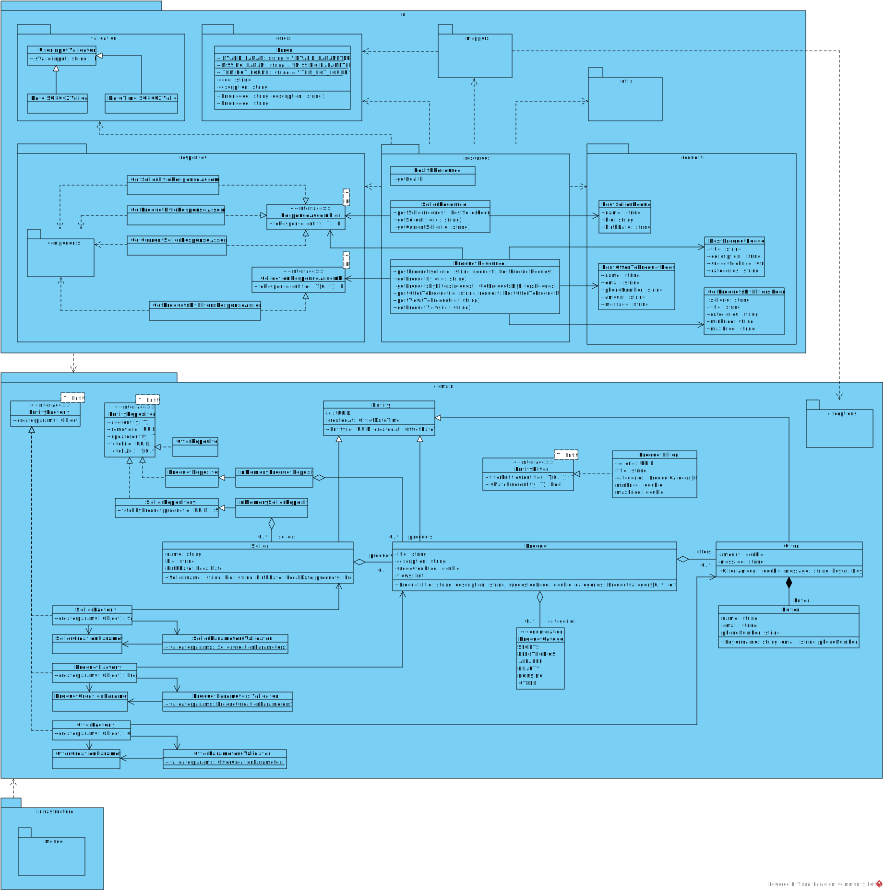
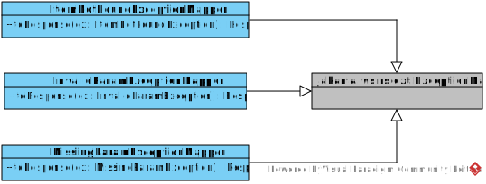
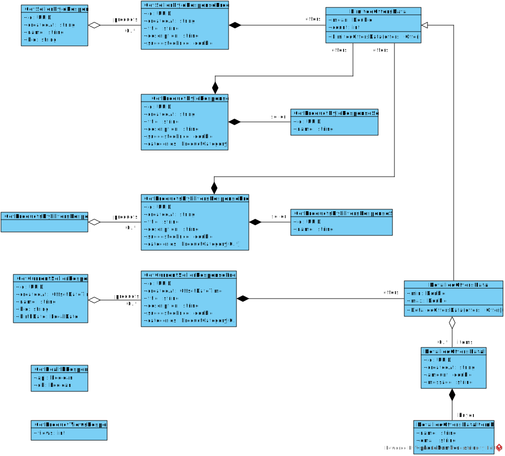
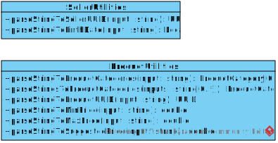
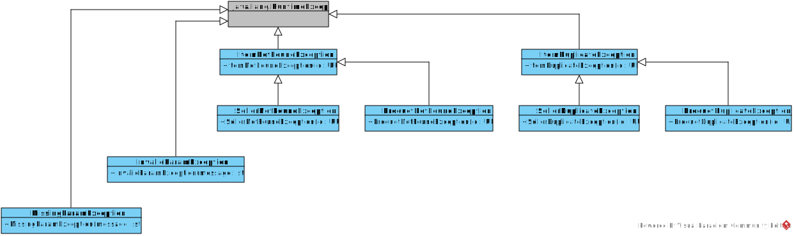
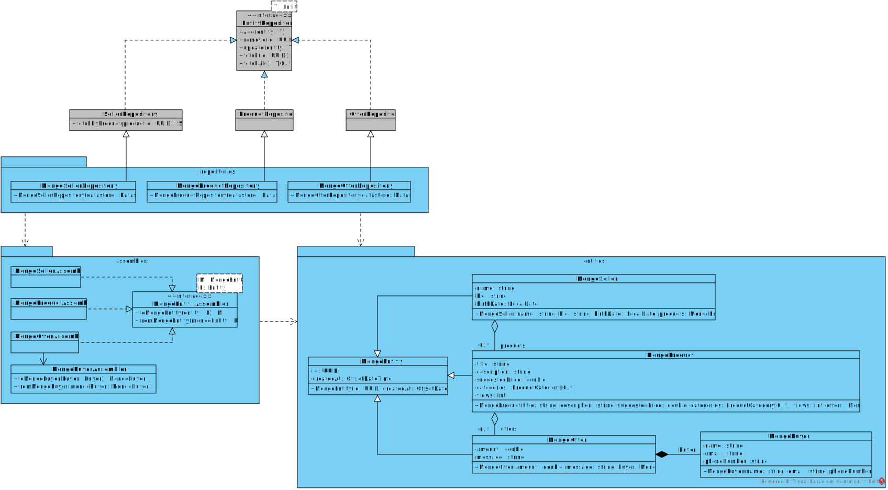

# Diagramme de classes conceptuelles

## Couche `ui`

### Diagramme de classes du _package_ `ui.mappers`

### Diagramme de classes du _package_ `ui.responses.components`

### Diagramme de classes du _package_ `ui.utils`

## Couche `domain`

### Diagramme de classes du _package_ `domain.exceptions`

## Couche `infrastructure`

### Diagramme de classes du _package_ `infrastructure.mongo`

